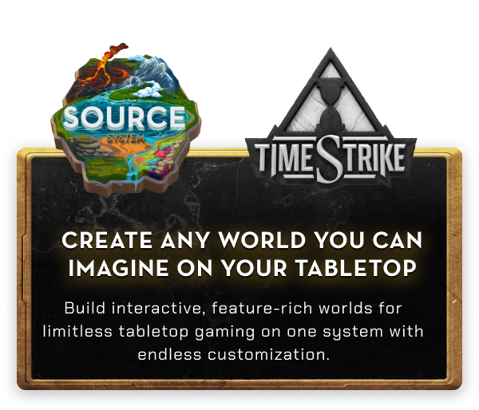

# Source Golf!

SOURCE GOLF!!!!

Source Golf is a golf simulation dice roller party game where players can build custom courses and play golf.  
Players will take turns choosing a club and hitting a golf ball towards the hole. 
Source Golf is a scaleable game. In terms of player counts, rounds played, and the size of the course, its all up to you. 

The SOURCE system’s hexes and tiles were purpose-built to allow for in-game terrain modularity, with the unique biome artwork directly impacting gameplay.



Check out the many games built for the Source System including [TimeStrike](https://github.com/Adventure-Together/TimeStrike)!

## Contributing
[](https://discord.gg/adventuretogether)

I used the following [link](https://www.geekering.com/programming-languages/filipesalgueiro/how-to-write-latex-documents-using-visual-studio-code/) to setup my local Visual Studio to build this repo.

Pull requests are required to merge back to the main and require approval.

If you are not tech savvy, feel free to make Github Issues detailing your request and somebody will be probably be glad to discuss it with you.

## Setup

### Preparing a new release

1. Run `./bin/bump-version` to tag the new version.

    ```sh
    ./bin/bumpversion <version>
    ```

2. Compile the example PDF.
3. Save the first page of the PDF as scrot.jpg.
4. Update the change log for the new release; commit your changes.
5. Push changes.

    ```sh
    git push && git push --tags
    ```

6. [Create a new release](https://help.github.com/articles/creating-releases/) and attach the PDF and scrot.

## Credits

* Background image from [Lost and Taken](https://lostandtaken.com/)
* Originally forked from [LaTeX-Template](https://github.com/rpgtex/DND-5e-LaTeX-Template)